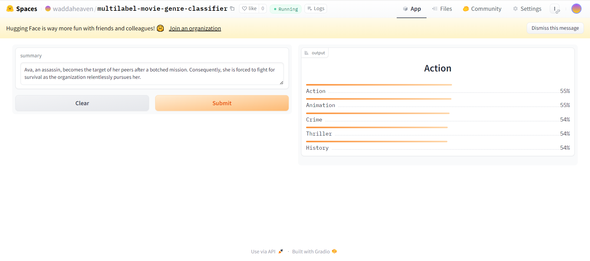
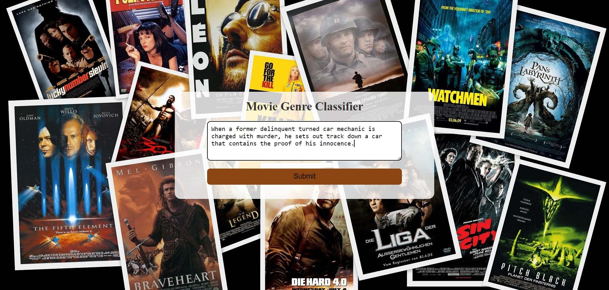
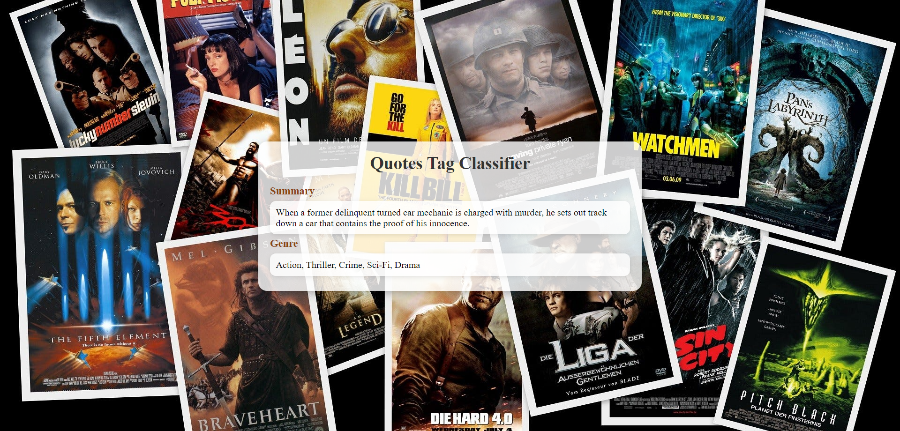

# Movie-Genre-Classifier
A text classification model from data collection, model training, and deployment.
The keys of ``deployment\genres_types_encoded.json`` shows the genres.

## Data Collection
Data was collected from MetaCritic Website Listing: [https://www.metacritic.com/browse/movie/all/all/all-time/new](https://www.metacritic.com/browse/movie/all/all/all-time/new) 
The data collection process is divided into 2 steps:

**Movie URL Scraping:** The movie URLs were scraped with ``scraper\movie_url_scraper.py`` and the URLs are stored along with the title in ``scraper\movie_urls.csv``.

**Movie Details Scraping:** Using the URLs, the titles, the URLs, the summaries and the genres are scraped with ``scraper\movie_details_scraper.py`` and they are stored in ``scraper\movie_details.csv.

In total, I scraped **25,929** movie details with their titles, URLs, summaries and genres.

## Data Preprocessing
Initially, there were **27** different genres in the dataset. After some analysis, I found out **3** of them were rare. So, I removed those genres and then I have **24** genres. After that, there were some duplicated values and I got a total of **25,377** samples after dropping them.

## Model Training
Finetuned ``distilroberta-base`` and ``bert-base-uncased`` models from HuggingFace Transformers using Fastai and Blurr. The model training notebook can be viewed in ``notebooks\genre_data_prep_and_model_implement.ipynb`` 
``distilroberta-base`` found as a best model after the comparison. 
## Model Compression and ONNX Inference
The trained distilroberta-base model has a memory of 315+MB. I compressed this model using ONNX quantization and brought it under 100MB

## Model Deployment
The compressed model is deployed to the HuggingFace Spaces Gradio App. The implementation can be found in ``deployment`` folder or [hf interface](https://huggingface.co/spaces/waddaheaven/multilabel-movie-genre-classifier)

## Web Deployment
Deployed a Flask App built to take summaries as input and show the genres as output. Check flask branch. 

The website is live website [(https://movie-genre-classifier.onrender.com)]

